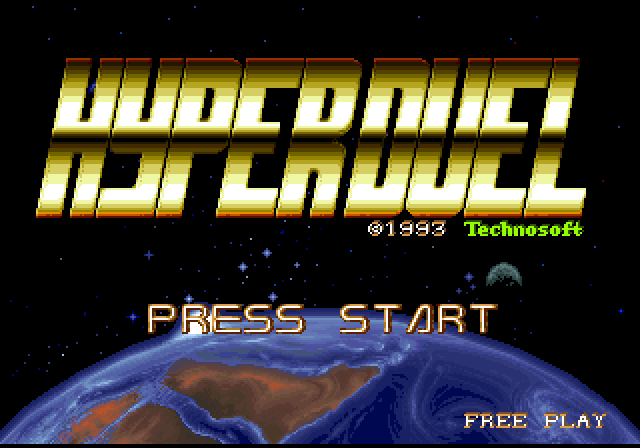
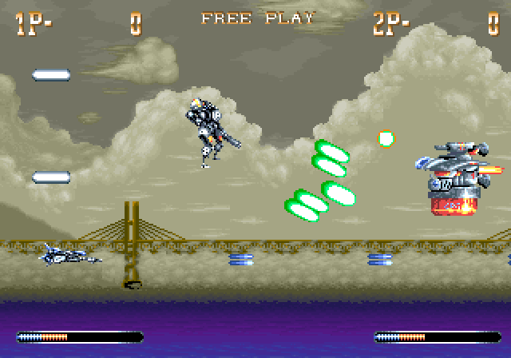

# Hyper Duel - MiSTer FPGA Core

Hyper Duel (Technosoft, 1993) for MiSTer.

 

*Screenshots taken on MiSTer with this core.*

The core includes the first FPGA implementation of the **Imagetek I4220**
video chip, used across the Metro Corp. arcade catalogue. There is no
datasheet for the chip, so it was built against MAME and then checked
against photos and recordings of real boards. Each finding in
[docs/ACCURACY.md](docs/ACCURACY.md) comes with its evidence and how to
reproduce it.

The CPUs and sound use established cores: two fx68k (Jorge Cwik),
jt51 and jt6295 (Jose Tejada).

## Features

- Playable start to finish, tested on real hardware on a CRT
- Hiscore autosave
- Native 60.24 Hz video timing, with a 60 Hz option in the OSD for
  displays that need it
- Shows the same 224 lines as a real cabinet, so the top-of-screen
  glitch seen in MAME is gone

## Install

Copy `releases/Arcade-Hyprduel_*.rbf` to `/media/fat/_Arcade/cores/`
and the MRA files to `/media/fat/_Arcade/`. Set 2 is in
`releases/_alternatives/`.

You need the MAME ROM sets (0.288 naming) in `/media/fat/games/mame/`:
`hyprduel.zip`, plus `hyprduel2.zip` for Set 2. No ROM data is
included in this repository.

## Controls and options

Buttons: Shot, Change, Bomb, Start, Coin, Service.

OSD: DIP switches (coinage including Free Play, Demo Sounds,
Difficulty, Lives, Flip Screen), video timing (Native 60.24 Hz or
60 Hz), boot warning screen, hiscore autosave, and the standard
scandoubler options.

## Findings

Where the core differs from MAME, and why. Full detail is in
[docs/ACCURACY.md](docs/ACCURACY.md).

- **Visible area.** The CRTC registers MAME ignores set the monitor's
  visible window. A real board shows lines 2 to 225 of the frame.
  Lines 0 and 1 are a hidden work area, and displaying them causes the
  top-of-screen scroll glitch seen in emulation. Reported to MAME in
  [mamedev/mame#15732](https://github.com/mamedev/mame/issues/15732).
- **Refresh rate.** The board runs 424 x 261 at 60.24 Hz, not 60 Hz.
  Measured from recordings of two boards, and matches the 261 lines
  the game programs.
- **OKI sample clock.** 2.000 MHz (the 4 MHz crystal halved), about
  3% lower than MAME's unverified value.
- **Raster interrupts.** The game requests one on every line and the
  core services all 261. MAME misses around 14%, which shows as
  stepped parallax.

## Architecture

- 2x fx68k at 10 MHz (main and sub CPU)
- Imagetek I4220 VDP: scanline renderer (3 tilemap layers, zoomed and
  flipped sprites), blitter, registers, interrupts, video timing
- jt51 (YM2151) and jt6295 (OKI M6295)
- SDRAM for program ROM, graphics and samples; everything else in BRAM

## Layout

```
Arcade-Hyprduel.*   Quartus 17 project (qpf/qsf/sdc/srf) and the MiSTer
                    shell (Arcade-Hyprduel.sv)
files.qip           Quartus file list, sourced by the qsf
sys/                MiSTer framework
rtl/                the core (i4220_*.sv, hyprduel_*.sv) + rtl/vendor/ cores
releases/           released RBF + MRA files (_alternatives/ for alt sets)
docs/               specs (i4220_spec.md, hyprduel_system_spec.md), ACCURACY.md,
                    plans and engineering handoffs
reference/          vendored MAME sources (BSD-3-Clause, the behavioural oracle)
sim/                Verilator harness: parity suites, full-system boot, soaks
tools/              ROM image builders, analysis tooling (tear scanner etc.)
magerror_wip/       Magical Error build, held back (see its README)
```

## Building and verifying

- Simulation: Verilator 5.x on any host; `sim/README` describes the
  one-time oracle bootstrap (MAME 0.288 + Python 3 + your ROM set),
  then `make verify blit-verify render-verify mame-verify vdp-verify`
  runs the 22-check parity suite and `make boot` boots the game
- Synthesis: Quartus 17 project at the repo root. Releases are only
  built from a fit with every clock meeting timing

## License and credits

GPL-3.0-or-later for the combined work. Vendored components keep their
own licences and headers. See `LICENSE` and `CREDITS.md`. The I4220
work relies on MAME's Imagetek driver by Luca Elia, David Haywood,
Angelo Salese and others.

Development used Anthropic's Claude as a coding tool.
